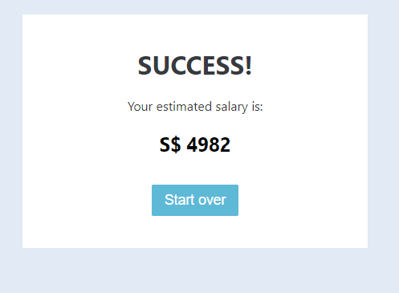

# Data Science Portfolio
 
## Project 1: Fake News Classifier (USA Presidential Elections 2016)

- Developed models to classify if a given news article related to the USA Presidential Election 2016 is fake or reliable news. Positive class indicates fake news and negative class indicates reliable news.
- Constructed the model based on the Kaggle Fake News Dataset which contains 20800 labeled news articles, of which about half are fake news articles and the other half are reliable news articles.
- Inspected for inherent patterns using unsupervised learning (K-means clustering) that will discriminate the news articles between fake and reliable, without referencing to the given labels.
- Conducted both Hashing Vectorisation and IF-IDF Vectorisation of the text data to determine which form of NLP Vectorisation produced to best performing model.
- Tested Passive Aggressive Classifier, Logistic Regression and XGBoost Regression Classifier. 
- XGBoost Regression Classifier on TF-IDF Vectorisaton was the best performing model, with an accuracy of 0.9978 on Test Data.
 - Built a client facing UI using Flask API, WTForms and Jinja2. 

#### XGBoost Classifier with TF-IFD Vectorisation (best performance)

Accuracy: 0.9978365

        precision    recall  f1-score   support

    0       1.00      1.00      1.00      2046
    1       1.00      1.00      1.00      2114

## Project 2: Malaria Classifier from Cell Image

- Developed an classifier to identify if a given cell is uninfected or parasitised by malaria based on an image of the cell.
- Utilised the Malaria dataset from the Tensorflow Datasets package.
- Constructed tensors representing the cell images
- Trained a Deep Learning model using containing dense and convolutional neural network layers
- Accuracy on test set: 0.9427
- AUC Score on test set: 0.9843

## Project 3: Monthly Salary Estimator for Data-related Jobs in Singapore

- Developed an estimator for the month salary of data-related jobs in Singapore (MAE ~ S$1345) to help jobseekers in the field of data negotiate their income upon landing the job.
- Scraped about 300 job descriptions from MyCareersFuture using Python and Selenium
- Created features from the open-text job descriptions to quantify the value companies put on relevant technologies related to data science (AWS, Python, SQL, R, Tableau, Excel, Powerbi, Spark, Hadoop, Tensorflow).
- Created models using common job parameters and the features from the job description using 5 regression models (Multiple Linear, Lasso, Random Forest, Gradient Boosting and Bootstrap Aggregation) tuned with GridsearchCV.
- Built a client facing UI using Flask API, WTForms and Jinja2.

